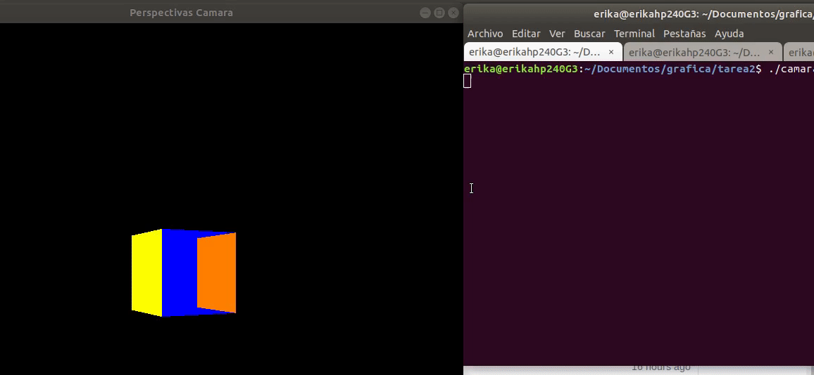

# Tarea de computación grafica:Cámara 
**Movimiendo la camara con el mouse**: Se ejecuta por las siguientes lineas:
```c++if(key==GLUT_KEY_F3){
    cout<<"Mover camara con mouse"<<endl;
    glutPassiveMotionFunc(MouseMotion);
    LOCAL_MyCamera->camMovimiento = CAM_PASEAR;
    LOCAL_MyCamera->camAtY = 0;
    LOCAL_MyCamera->camViewY = 0;
    SetDependentParametersCamera( LOCAL_MyCamera );
}
```


 **Cambiar el punto de vista de la camara:** Se pulsa la F4 para poder cambiar de respectiva a ortogonal y F7 para cambiar de ortogonal a prespectiva:
```c++
  }
	if(key==GLUT_KEY_F4){
		if(LOCAL_MyCamera->camProjection == CAM_CONIC){
		LOCAL_MyCamera->x1=-5;//
		LOCAL_MyCamera->x2=7;////aumenta enflaquese
		LOCAL_MyCamera->y1=-5;//
		LOCAL_MyCamera->y2=6;//
		LOCAL_MyCamera->z1=-20;
		LOCAL_MyCamera->z2=500;
		LOCAL_MyCamera->camProjection = CAM_PARALLEL;
		cout<<"Modo de Proyección Ortogonal"<<endl;
		}else{
			cout<<"Modo de Proyección Perspectiva"<<endl;	
			LOCAL_MyCamera->camProjection = CAM_CONIC;
		}
  }
 ```
 
 
**Movimiento del objeto con el teclado:** Su codigo de ejecución es lo siguiente.
```c++
if (key==GLUT_KEY_UP){
      cout<<"Movimiento Arriba"<<endl;
      PanCamera(LOCAL_MyCamera,0,-1);}
if (key==GLUT_KEY_DOWN){
    cout<<"Movimiento Abajo"<<endl;
    PanCamera(LOCAL_MyCamera,0,1);}
if (key==GLUT_KEY_LEFT){
    cout<<"Movimiento Izquierda"<<endl;
    PanCamera(LOCAL_MyCamera,1,0);}
if (key==GLUT_KEY_RIGHT){
    cout<<"Movimiento Derecha"<<endl;
    PanCamera(LOCAL_MyCamera,-1,0);}

if (key==GLUT_KEY_RIGHT){
    cout<<"Movimiento Derecha"<<endl;
    PanCamera(LOCAL_MyCamera,-1,0);}
```


```c++
 if(key==GLUT_KEY_F5){ 
    cout<<"Latitud"<<endl;
    Rotar_Latitud(LOCAL_MyCamera, 0.1);}
  if(key==GLUT_KEY_F6){
    cout<<"Longitud"<<endl;
    if(aumentlatitud<4 or aumentlatitud==2){
      aumentlatitud+=1;
      Rotar_Longitud(LOCAL_MyCamera, aumentlatitud);}
    else{
      aumentlatitud-=1;
      Rotar_Longitud(LOCAL_MyCamera, aumentlatitud);}
  }
```

**Movimiento del objeto con el teclado y mouse:** Se activa con teclas funcionales(f2,f3,f4,..) y con el click derecho del mouse.
Movimiento del objeto en proyección.


